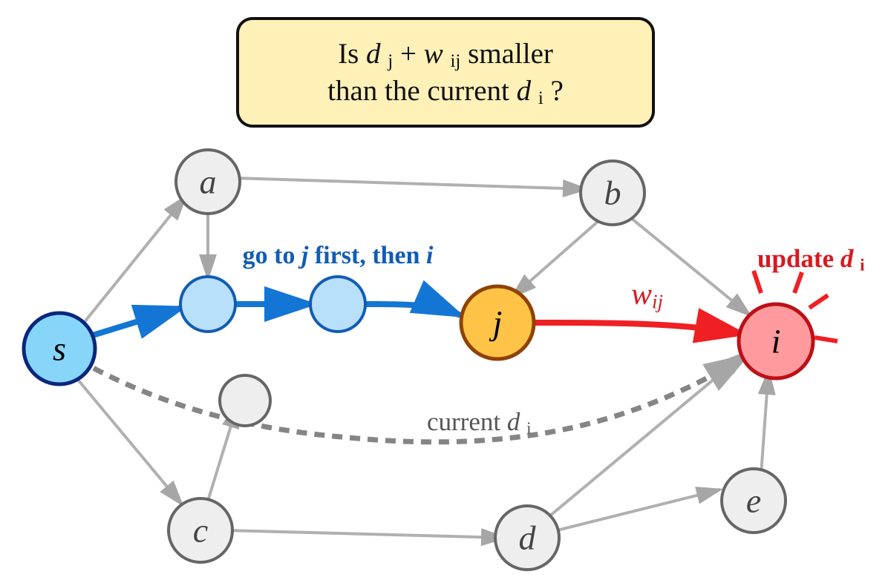
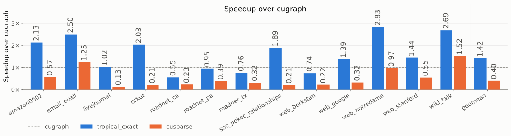

# Tropical Shortest Paths with CUDA


"Did you know that you can solve the single-source shortest path (SSSP) problem via matrix-vector multiplication?"

This project implements an algorithm that I will refer to as "tropical" and compare it to cuGraph's implementation.
The tropical algorithm requires a variation of SpMV that cuSPARSE's standard SpMV does not provide (see below).

Here, I want to answer a few practical questions:

- **Q1**: How does a tropical SSSP solver compare with the cuGraph's SSSP solver?
- **Q2**: Can optimized sparse-matrix libraries such as cuSPARSE solve SSSP without a custom tropical matrix multiply?

I evaluate these questions on graphs from the [SNAP dataset collection](https://snap.stanford.edu/data/).

## Tropical SSSP

With the advent of Tensor Cores and other dedicated hardware for linear algebra, more and more algorithms have been reformulated in terms of matrix multiplication.
The following is a well-known formulation based on [tropical algebra](https://en.wikipedia.org/wiki/Tropical_semiring) of the [Bellman-Ford algorithm](https://en.wikipedia.org/wiki/Bellman%E2%80%93Ford_algorithm).

### The Exact Formulation (`minplus_spmv`, `minplus_spmmop`)

A matrix-vector product computes each output element by combining a matrix row with an input vector. In ordinary arithmetic and in a generic algebraic form, respectively, it is:

$$
\begin{aligned}
y_i &= \sum_j W_{ij} x_j
&\qquad\qquad
y_i &= \bigoplus_j \left(W_{ij} \otimes x_j\right).
\end{aligned}
$$

On the left, $+$ is addition and juxtaposition is multiplication. On the right, $\oplus$ is the addition operation and $\otimes$ is the multiplication operation, which a semiring is free to redefine.
For the min-plus, or [tropical](https://en.wikipedia.org/wiki/Tropical_semiring), semiring, they are:

$$
a \oplus b = \min(a, b)
\qquad\qquad
a \otimes b = a + b.
$$

Let $d_i$ be the best distance known so far for vertex $i$, and $w_{ij}$ be the cost of going from $j$ to $i$.
As the figure below shows, relaxing $i$ asks whether going to $j$ first and then taking the edge to $i$ is shorter than the current $d_i$.

<p align="center">
  
</p>

One [Bellman-Ford](https://en.wikipedia.org/wiki/Bellman%E2%80%93Ford_algorithm) relaxation is therefore a tropical matrix-vector product:

$$
d_i \leftarrow \min_j\left(w_{ij} + d_j\right) = \bigoplus_j \left(w_{ij} \otimes d_j\right).
$$

Here a missing edge has cost $\infty$ and $w_{ii} = 0$ for every vertex $i$.
Repeating the product propagates distances through the graph. The idea is inspired by Michael Garland's paper, *Sparse matrix computations on manycore GPUs*.

### An Approximate Formulation (`softmin_spmv`)

Because a graph's adjacency matrix is sparse, this operation is an SpMV, but cuSPARSE's standard SpMV supports only ordinary arithmetic rather than the min-plus variant.
Its preview `cusparseSpMMOp` API accepts custom operators, which the `minplus_spmmop` backend uses to compute the exact min-plus product.
One alternative is to transform the weights and distances so that conventional arithmetic SpMV approximates the tropical product.
For a positive parameter $\beta$, define the forward transformation and its inverse as:

$$
T_\beta(x) = e^{-\beta x}
\qquad\qquad
T_\beta^{-1}(z) = -\frac{1}{\beta}\log z.
$$

Thanks to the property of exponentials, the ordinary sum of two scalars $x$ and $y$ is a product in the transformed space:

$$
T_\beta(x) T_\beta(y) = T_\beta(x+y)
$$

For the min operation, one can prove that ordinary addition in the transformed space becomes equivalent in the limit:

$$
\min(x, y) = \lim_{\beta \to \infty} T_\beta^{-1}\left(T_\beta(x) + T_\beta(y)\right).
$$

As a result, the expression is a soft-min, and it approaches the true minimum as $\beta$ grows.
Unfortunately, finite-precision arithmetic makes this transformation numerically fragile, as explained in [Floating-Point Considerations](docs/floating_point.md).

## Solvers

- `cugraph`: the SSSP implementation of RAPIDS cuGraph, used as the baseline.
- `minplus_spmv`: a hand-written CUDA kernel that computes the min-plus SpMV.
- `minplus_spmmop`: the same exact product, computed by cuSPARSE's `cusparseSpMMOp` with min-plus operators compiled at run time.
- `softmin_spmv`: approximates the min-plus product with cuSPARSE's ordinary SpMV in the exponential domain.

## Quick start

Build the project:

```sh
make
```

Download the SNAP inputs and convert them to memory-mappable CSR binaries:

```sh
make inputs
make inputs-large    # if you feel courageous
```

Run the hand-written tropical solver:

```sh
./build/sssp data/web-Google.csrbin --solver minplus_spmv --runs 1
```

Run cuGraph on the same input:

```sh
./build/sssp data/web-Google.csrbin --solver cugraph --runs 1
```

## Evaluation

Each run prints the time in seconds of the following steps:

- `setup`: one-time preparation on the GPU, such as allocating memory and uploading the graph.
- `kernel`: computing the distances, printed once per repetition.
- `download`: copying the distances back to the host.
- `end_to_end`: the whole solver call, which is roughly `setup`, plus every `kernel`, plus `download`.

None of them include loading the graph from disk, creating the CUDA context, or transposing the graph.

For each graph, we use the source that led to the longest running time.

All measurements were taken on an NVIDIA A30X (24 GB) with an Intel Xeon Gold 6238L host, using CUDA 13.0, Clang 22, and cuGraph 25.10 in a Release build.

The plot below shows each solver's `kernel` speedup over cuGraph, using the median of 10 runs.

<p align="center">
  
</p>

- **Answer to Q1**: `minplus_spmv` is faster than cuGraph on 9 of the 13 graphs, by up to 2.8x and 1.4x on geometric mean. It is slower on the road networks and web-BerkStan, whose long shortest paths take hundreds of iterations that each recompute every vertex, while cuGraph only updates the vertices that changed. `minplus_spmmop` computes the same exact product but is not efficient: it is 2.5x slower than cuGraph on geometric mean, for reasons still under investigation.
- **Answer to Q2**: Work in progress!

## Dependencies

The `cugraph` backend requires a separate [RAPIDS libcugraph installation](https://docs.rapids.ai/api/cugraph/legacy/installation/getting_cugraph/). CMake enables it when it finds `cugraph::cugraph_c`.

## References

- Michael Garland. "Sparse matrix computations on manycore GPU's." *Proceedings of the 45th Annual Design Automation Conference (DAC)*, pp. 2–6, 2008.
- Andrew Davidson, Sean Baxter, Michael Garland, and John D. Owens. "Work-efficient parallel GPU methods for single-source shortest paths." *2014 IEEE 28th International Parallel and Distributed Processing Symposium (IPDPS)*, pp. 349–359, IEEE, 2014.
